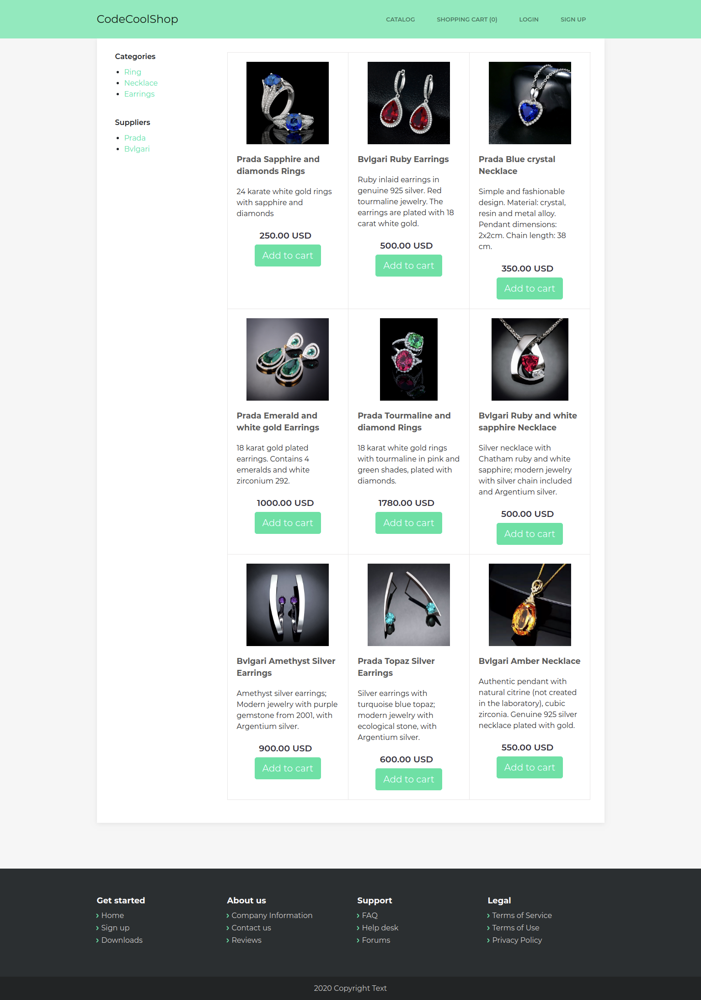
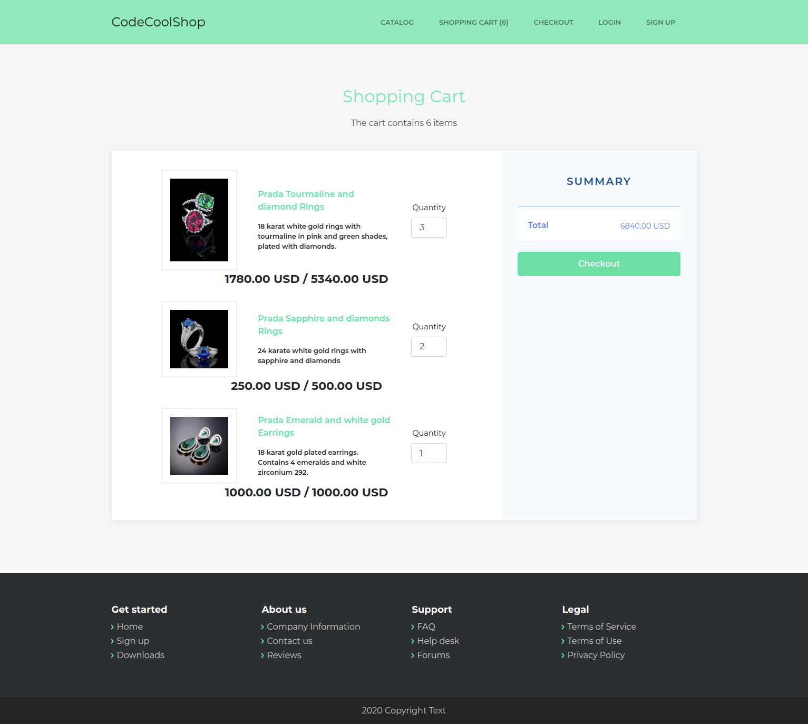

# Codecool Online Shop

## Description

Online web-application with Java, using Maven, Java Servlets, PostgreSQL and JUnit,
where users can browse products, add them into a shopping cart, checkout items and
make payments.

## Installation

Import this project to IntelliJ as a Maven project.
IntelliJ can auto-install the dependencies based on the pom.xml

## Screenshoots

